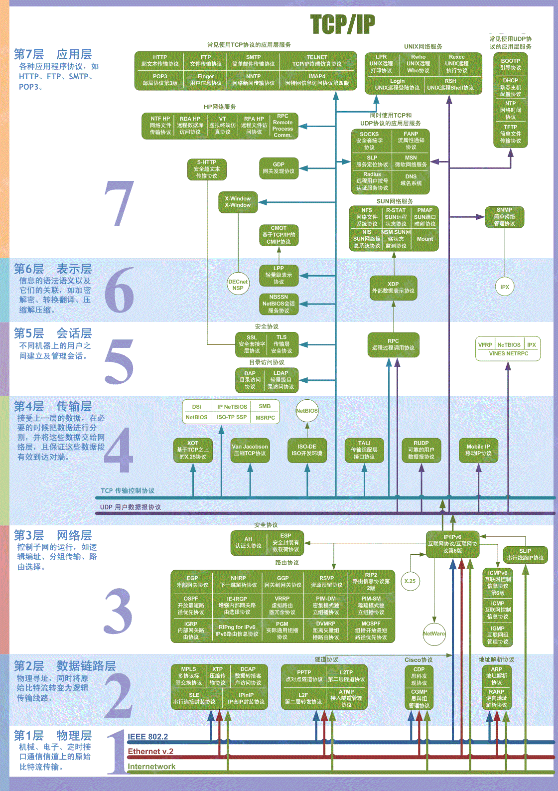
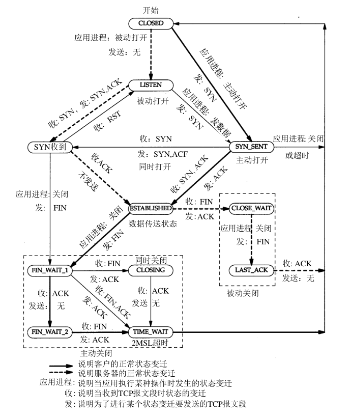
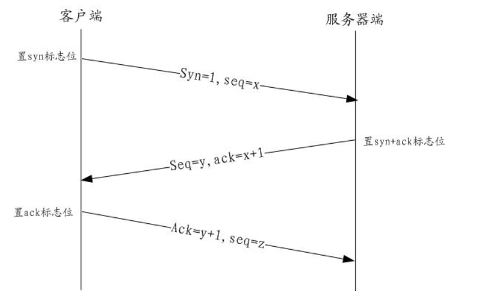

# 一. 网络通信

* 互联网中主机和主机连接必须遵守特定的要求,这个要求称为协议
* OSI(Open System Interconnection)开放式系统互联.定义了计算机互联时网络通信的7层(图片来源互联网)
  
* 目前大规模使用的是TCP/IP协议(图片来源互联网)
  * 应用层
    * 合并OSI中5,6,7层(会话层,表示层,应用层)
    * 常用协议:HTTP,FTP,SMTP,POP3,SSL,RPC
  * 传输层
    * OSI中第4层
    * 常用协议TCP,UDP
  * 网络层
    * OSI中第3层
    * 常用协议:IP,IPV4,IPV6
  * 网络接口层
    * OSI中第1,2层
* 以QQ举例,在tcp/ip中执行过程
  

# 二. IPV4和IPV6

* IP (Internet Potocol)网络协议,互联网上任何操作系统只要遵守IP协议就可以与互联网互通.
* Ipv4和IPv6中的v是Version,即版本的意思
* 互联网上每台电脑的IP是唯一的.
* IP本质就是给连接到互联网上的计算器分配32位地址.由于二进制32位地址比较难记,所以用十进制表示.为了更方便记忆使用”点”拆分法,分成四段,每段8位,即每段最大255
* 随着互联网的发展,接入网络的计算机在增多,IPv4逐渐无法满足大量计算机数量.IPv4的下个版本IPv6就出现了
* IPv6 是128位,是IPv4的4倍.且以16位进制表示
# 三.TCP和UDP

* 英文全称 Transmission Control Protocol

* 中文全称 传输传输控制协议

* 是TCP/IP中传输层协议.一种面向连接的、可靠的、基于字节流的协议.

* TCP协议每次连接/关闭都需要”确认”,也就是经典的连接三次握手,断开连接四次握手

* TCP中几个术语
  * SYN 同步标识
  * FIN 结束标识
  * ACK 确认标识
  * PSH 有DATA传输
  * RST 连接重置
  * SEQ 数据包
  
* TCP状态迁移图

  

* 三次握手(Listen阶段在协议栈)
  

  * 客户端发送SYN=1,SEQ=number(随机数字)报文给服务器端,客户端进入SYN_SEND状态
  * 服务器收到SYN报文,SYN=1知道客户端要建立连接,响应ACK NUMBER(客户端SEQ+1),SYN=1,ACK=1,SEQ=随机数字,连接状态SYN_RECV状态
  * 客户端收到SYN,检查ACK NUMBER和ACK=1是否正确,如果全部正确,向服务器端发送ACK NUMBER=服务端SEQ+1和ACK=1.服务器接收到后检查是否正确,正确后建立连接.连接状态进入ESTABLISHED

* TCP关闭连接需要四次握手,包含一次角色转换.(以客户端主动发起关闭请求举例)
  
  
  * 主机A(主动方, Active Close)向主机B(被动方)发送FIN表示数据发送完成ACK=z,SEQ=x.主机A进入FIN_WAIT1状态,这个状态非常短暂.之后等待对方确认ACK过程自己进入FIN_WAIT2状态.如果超时没有收到ACK直接进入CLOSED状态		
  * 主机B收到FIN后返回主机A内容ACK=x+1,SEQ=z,主机B进入CLose_wait状态
  * 主机B关闭连接发送给主机A内容ACK=x,SEQ=y.主机A进入到TIME_WAIT状态,处于这个状态后等待2个报文最大存活周期后进入CLOSED状态.此时主机B进入LAST_ACK状态
  * 主机A收到后返回ACK=y+1,SEQ=x
  
* UDP
  * User Datagram Protocol 用户数据报协议
  * 是一种无连接的协议
  * 基于UDP协议主机把数据包发送给网络后就不管了,是一种不可靠协议
  
* TCP和UDP的主要区别
  * TCP是安全可靠的,UDP是不安全,不可靠的
  * UDP的速度要高于TCP