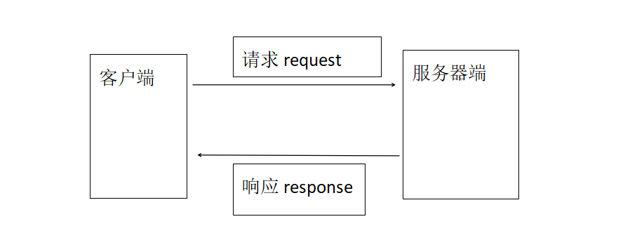

# 一. HTTP

* Http:无状态协议,是互联网中使用Http实现计算机和计算机之间的请求和响应
  * Http使用纯文本方式发送和接收协议数据,不需要借助专门工具进行分析就可以知道协议中数据
* Http报文(message)组成部分
  * 请求行(request-line)
  * 请求头(head)
  * 请求体(body)
  * 响应头
  * 响应体
* HTTP 1.1 实现了多种请求方式
  * GET : 向服务器请求资源地址
  * HEAD  : 只要求响应头
  * POST : 直接返回请求内容
  * PUT : 创建资源
  * DELETE : 删除资源
  * TRACE : 返回请求本身
  * OPTIONS :返回服务器支持HTTP方法列表
  * CONNECT : 建立网络连接
  * PATCH :修改资源y
* 软件模型
  * B/S结构,客户端浏览器/服务器,客户端是运行在浏览器中.
  * C/S结构,客户端/服务器,客户端是独立的软件
* HTTP POST简易模型图
  

# 二. Go语言对HTTP支持
* 在Golang的net/http包提供了HTTP客户端和服务端的实现
* HandleFunc()可以设置函数的请求路径

```go
// HandleFunc registers the handler function for the given pattern
// in the DefaultServeMux.
// The documentation for ServeMux explains how patterns are matched.
func HandleFunc(pattern string, handler func(ResponseWriter, *Request)) {
	DefaultServeMux.HandleFunc(pattern, handler)
}
```

* ListenAndServer实现了监听服务

```go
// ListenAndServe always returns a non-nil error.
func ListenAndServe(addr string, handler Handler) error {
	server := &Server{Addr: addr, Handler: handler}
	return server.ListenAndServe()
}
```

* 代码示例

```
package main

import "fmt"
import "net/http"

func welcome(res http.ResponseWriter, req *http.Request) {
   fmt.Fprintln(res, "Hello World Golang Web,哈哈")
}

func main() {
   http.HandleFunc("/", welcome)
   http.ListenAndServe("localhost:8090", nil)
   fmt.Println("服务已启动") //此行代码不执行,上面代码一直在监听localhost:8090端口
}
```