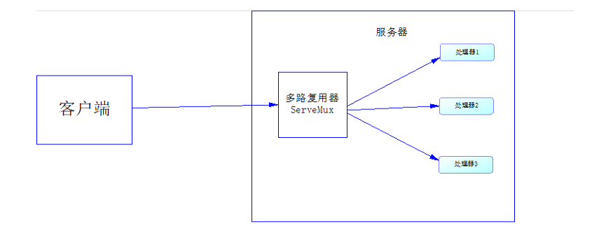

# 一.Restful风格请求

* 在目前所学内容中每个请求都需要绑定一个HandlerFunc,而在实际项目中会有很多URL,且可能出现满足特定规律的URL,例如: /sxt/it和/sxt/baizhan都是以/sxt/开头.且如果这两个URL里面代码也差不多时,写两个Func就属于代码冗余了.
* 可以使用restful风格把满足特定格式url和功能类似的代码提入到一个func中实现代码复用.

# 二.Go语言的多路复用器

* 在http包中提供了ServeMux实现多路复用器,它会对URL进行解析,然后重定向到正确的处理器上



* ServeMux是一个结构体,里面存放了map和读写锁

```go
type ServeMux struct {
	mu    sync.RWMutex
	m     map[string]muxEntry
	hosts bool // whether any patterns contain hostnames
}
```

* 在Go语言中有提供了ServeMux的对象DefaultServeMux,

```go
var DefaultServeMux = &defaultServeMux

var defaultServeMux ServeMux
```

* 而平时使用的http.Server不指定Handler属性时默认就是DefaultServeMux

# 三.使用第三方实现Restful风格

* 可以使用命令,从github上下载第三方库,下载后放入到%GOROOT%/src/github.com中

```
go get github.com/gorilla/mux
```

* 使用mux包的Router实现restful风格

```go
package main

import (
	"net/http"
	"fmt"
	"github.com/gorilla/mux"
)

func hello(w http.ResponseWriter, r *http.Request) {
	vars := mux.Vars(r)
	fmt.Fprintln(w, "dayinle", vars["key"])
}

func abc(w http.ResponseWriter, r *http.Request) {
	fmt.Fprintln(w, "abc")
}
func main() {
	r := mux.NewRouter()
	r.HandleFunc("/hello/{key}", hello)
	r.HandleFunc("/abc", abc)
	http.ListenAndServe(":8090", r)
	//s:=http.Server{Addr:":8090",Handler:r}
	//s.ListenAndServe()
}

```

